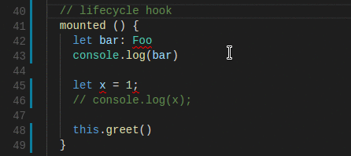

# vscode-tslint-vue

 

VSCode extension for tslint with added support for .vue (single file component) files and compiler/typechecker level linting.



1. For linting to work in `.vue` files, you need to ensure your script tag's language attribute is set
to "ts": `<script lang="ts">...</script>`.  
2. You can turn on linting at the typechecker level by setting the `typeCheck` tslint option to `true` in your settings.json (File > Preferences > Settings - Workspace):

```json
// .vscode/settings.json
{
	// ...

    "tslint.typeCheck": true, 

	// ...
}

```
*This extension assumes you have a `tsconfig.json` file located at the root of your current project/workspace and a folder `src/`
also located at the root as well (*don't put the tsconfig file inside that src folder*). A future update will soon make this more flexible.*  

3.  This is a fork of [vscode-tslint](https://marketplace.visualstudio.com/items?itemName=eg2.tslint) so you can read more information from that repo.

## Development setup
- run npm install inside the `tslint` and `tslint-server` folders
- open VS Code on `tslint` and `tslint-server`

## Developing the server
- open VS Code on `tslint-server`
- run `npm run compile` or `npm run watch` to build the server and copy it into the `tslint` folder
- to debug press F5 which attaches a debugger to the server
- to trace the server communication you can enable the setting: "tslint.trace.server": "verbose", "messages"

## Developing the extension/client
- open VS Code on `tslint`
- run F5 to build and debug the extension

> If you want to debug server and extension at the same time; 1st debug extension and then start server debugging

## Publishing to marketplace

- Make sure you have `vsce` installed: `npm install -g vsce`.
- To publish (from the tslint directory): `vsce publish`.